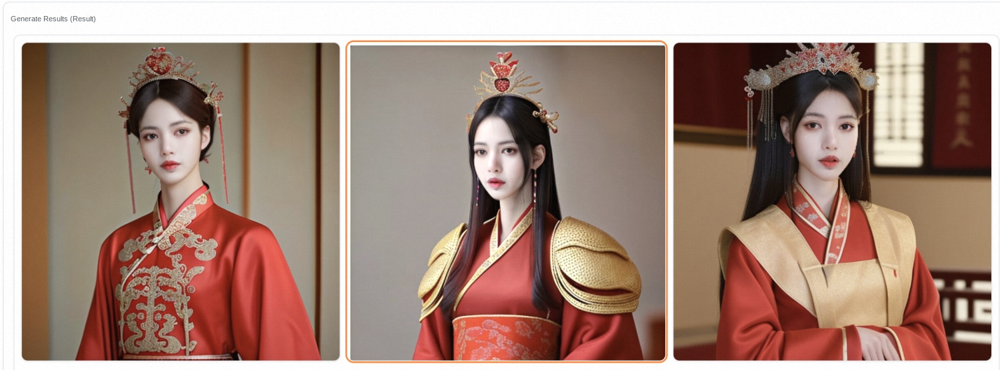
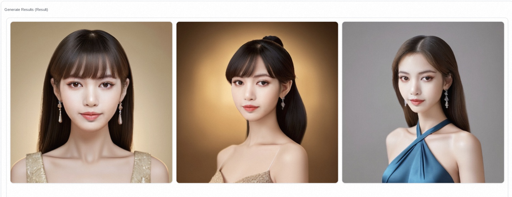
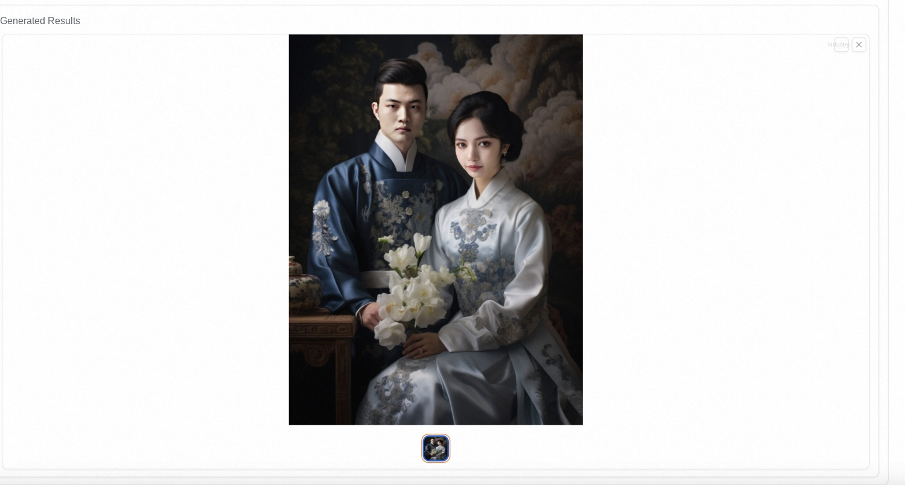
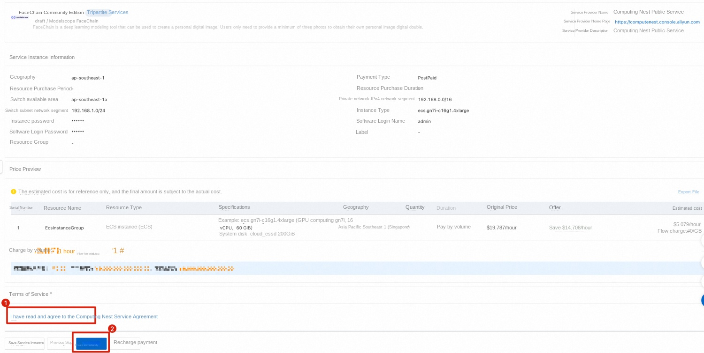
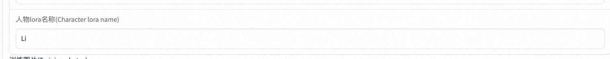
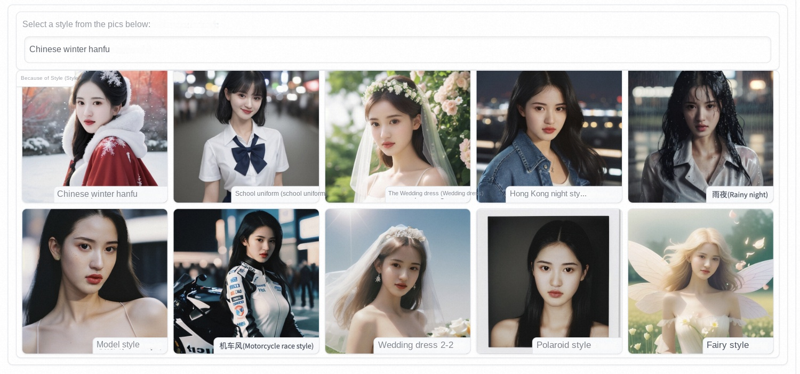
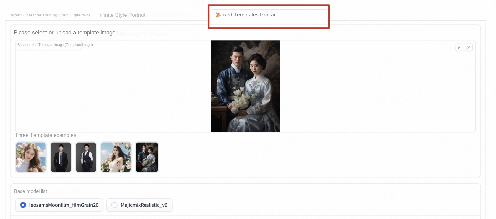

# FaceChain-computing nest to achieve personal image customization
## 09-19 Update Content
-New version supports specified style customization
-Support prompt and Negative prompt optimization
-Support attitude control
-Support multi-person photo

Currently supported styles are as follows:

| Winter Hanfu (Chinese winter hanfu) | Fairy style |
| --- | --- |
| school uniform style (School uniform) | antique (traditional chinese style) |
| Wedding dress (Wedding dress) | Zhuang clothing style (Zhuang style) |
| Hong Kong night style | European European fields |
| Rainy night | Snow Mountain Down Jacket (Jacket in Snow Mountain) |
| Model style | Work clothes (Working suit) |
| Motorcycle race style | Armor |
| Wedding Dress -2(Wedding dress 2) | T-Shirt (T-shirt) |
| Polaroid style (Polaroid style) | Hanfu style (Hanfu) |
| Cybernetics punk | Women's Evening Dresses (Gown) |
| Phoenix crowns and robes (Chinese traditional gorgeous suit) | |

# Foreword
It's been 3202 years, and if you don't have a personal digital image of your own, you really can't catch up with the times.❗️❗️❗️❗Br/> if you don't know how to generate your own personal digital image, please let me introduce it to you: br />* * FaceChain * *-the open source flat replacement of miaoya camera, a deep learning model tool that can be used to create personal digital image, only needs three photos (highlight, only three!!) You can generate your own unique personal digital image double, and come to [Computing Nest](https://computenest.console.aliyun.com/user/cn-hangzhou/recommendService) to experience it quickly! Br/> don't say much, look at the picture first!  
 
 
 
 
 
 

# Service creation
First of all, find the FaceChain community version in the [calculation nest console](https://computenest.console.aliyun.com/user/cn-hangzhou/recommendService), click on the official creation, or directly click [here](https://computenest.console.aliyun.com/user/cn-hangzhou/serviceInstanceCreate?ServiceId=service-0f4f642c994647cfbad8).  
 

Step 2: Select the region and instance type of the resource deployment, and enter the instance password.  ⚠Note that if the instance specification list is empty, the inventory in the current region may be insufficient, please switch to another region and try again!  
 
The third step, fill in the software login name and password.⚠* * Be sure to remember your password, otherwise you cannot log in to the software later * *⚠️ 
 
Step 4: Configure the zone and VPC.  
 
Step 5, click "Next: Confirm Order" to jump, check "I have read and agree to the Computing Nest Service Agreement", and click Create Now.  
 
After the submission is successful, click Go to List View to see the deployment progress.  
 
After waiting for the status to change to Deployed, click Details to go to the service instance details page.  
 
 
Step 6, click Endpoint, enter the user name and password just set to log in to the FaceChain interface and start creating!  
 
# Image customization
## Select base model
First, select the basic model of interest. Different basic models contain different style types.  
 

## Upload photos
Step 1: Enter the name of the current person and click to select the picture to upload. In order to ensure the quality, it is advisable to select a clear head and shoulders photo.  
 
 

## Start training
Step 2: after * * all the pictures above are loaded * *, click "start training" and wait patiently ~ ~ 
 
Until the output signal appears "Training is complete!", At this time, you can happily proceed to the next step!!!
 

## Image customization
Step 3: Generate the image!   switch to the "infinite style image photo" tab, select the basic model that has just been trained, and find your character LoRA.  
 
Then click to select the style type you like ~ 
 
Enter the number of pictures you want to generate, or you can also perform various advanced operations in advanced options ~ including prompt optimization, parameter adjustment, etc.  
 
After waiting for * * to be generated * *, you can get your own digital image!  
 

## Fixed template generation
Switch to the fixed template image photo page, you can generate your digital writing according to the specified template, or you can add multiple face information to the photo to generate a group photo ~ 
 

# Generation Principle
The ability of the AI to generate personal photos comes from the literary graph function of the Stable Diffusion model, that is, to input a piece of text or a series of prompt words and output the corresponding image. There are two main factors that affect the effect of personal photo generation: photo style information and user character information.  
 

## Training phase
The input of the training phase is the image uploaded by the user that contains the clear face area, and the output is the face LoRA model.  
Specifically, firstly, the image rotation model based on orientation judgment and the face refinement rotation method based on face detection and key point model are used to process the image uploaded by the user and obtain the image containing the positive face. Next, the human body analysis model and the portrait skin model are used to obtain high-quality face training images. Subsequently, the project uses the face attribute model and the text annotation model, combined with the label post-processing method, the refined label of the training image is generated, and finally the stable Diffusion model is fine-tuned using the above image and label data to obtain the face LoRA model.
## Reasoning phase
The input of the inference stage is the image uploaded by the user in the training stage and the preset input prompt for generating a personal portrait, and the output is a personal portrait image.   in the reasoning stage, the project first integrates the weights of the face LoRA model and the style LoRA model into the Stable Diffusion model. Next, the literary graph function of the Stable Diffusion model is used to initially generate personal photo images based on the preset prompt. Subsequently, the project uses the face fusion model to further improve the face details of the above photo images, the template face used for fusion is selected in the training image by the face quality assessment model, and finally the similarity between the generated photo image and the template face is calculated by the face recognition model, so as to sort the photo image and output the top-ranked personal photo image as the final output result.
# Summary
In a few simple steps, you can generate a set of your own digital image in the calculation nest. For such a simple and convenient scheme, come and calculate the nest to find out!
# Reference
FaceChain items:[https://github.com/modelscope/facechain](https://github.com/modelscope/facechain)  heart of machine report:[https://mp.weixin.qq.com/s?__biz=MzA3MzI4MjgzMw==&mid=2650887719&idx=5&sn=040aeffa5c3b6ae1e5862912170e8a15](https://mp.weixin.qq.com/s?__biz=MzA3MzI4MjgzMw==&mid=2650887719&idx=5&sn=040aeffa5c3b6ae1e5862912170e8a15)
